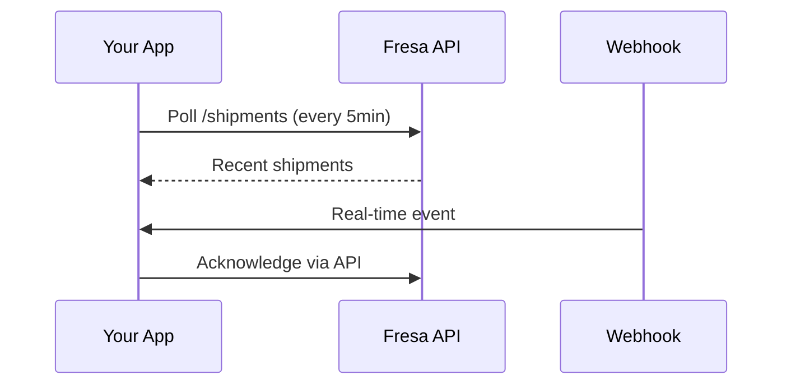

## Overview

Fresa Technologies supports seamless integrations with popular third-party services in the freight and shipping ecosystem. You can connect your account to accounting tools, carriers, and e-commerce platforms to automate quoting, documentation, and tracking. The RESTful API enables custom workflows, while webhooks keep your systems in sync with real-time events like shipment updates.

<Columns cols={3}>
  <Card title="Accounting" icon="dollar-sign" href="/docs/accounting-integrations">
    Sync invoices and payments with QuickBooks or Xero.
  </Card>
  <Card title="Carriers" icon="truck" href="/docs/carrier-integrations">
    Direct connections to DHL, FedEx, and UPS for label generation.
  </Card>
  <Card title="E-commerce" icon="shopping-cart" href="/docs/ecommerce-integrations">
    Import orders from Shopify and WooCommerce automatically.
  </Card>
</Columns>

## API Authentication

Start by generating an API key from your Fresa dashboard. This key authenticates all requests using Bearer token authorization.

<Steps>
  <Step title="Navigate to Settings" icon="settings">
    Log in to your Fresa account and go to **Account > API Keys**.
  </Step>
  <Step title="Create Key" icon="key">
    Click **Generate New Key**, add a name like "Production Integration", and copy the key securely.
  </Step>
  <Step title="Store Securely" icon="lock">
    Save the key as an environment variable: `FRESA_API_KEY`.
  </Step>
</Steps>

<Callout kind="tip">
  Rotate keys every 90 days and restrict scopes to minimize risks.
</Callout>

## Making API Requests

The API base URL is `https://api.fresa.io/v1`. All endpoints require the `Authorization: Bearer YOUR_API_KEY` header.

<Request tabs="JavaScript,Python,cURL">
  ```javascript
  const response = await fetch('https://api.fresa.io/v1/shipments', {
    method: 'GET',
    headers: {
      'Authorization': `Bearer ${process.env.FRESA_API_KEY}`,
      'Content-Type': 'application/json'
    }
  });
  const shipments = await response.json();
  ```
  ```python
  import requests
  headers = {
      'Authorization': f'Bearer {os.getenv("FRESA_API_KEY")}',
      'Content-Type': 'application/json'
  }
  response = requests.get('https://api.fresa.io/v1/shipments', headers=headers)
  shipments = response.json()
  ```
  ```bash
  curl -X GET 'https://api.fresa.io/v1/shipments' \
    -H 'Authorization: Bearer YOUR_API_KEY' \
    -H 'Content-Type: application/json'
  ```
</Request>

<Response tabs="200,401">
  ```json
  {
    "data": [
      {
        "id": "shp_abc123",
        "status": "in_transit",
        "tracking_url": "https://dhl.com/track/123456"
      }
    ],
    "meta": {
      "total": 1,
      "page": 1
    }
  }
  ```
  ```json
  {
    "error": {
      "code": "unauthorized",
      "message": "Invalid API key"
    }
  }
  ```
</Response>

<ParamField path="shipment_id" param-type="string" required="true">
  Unique shipment identifier, e.g., `shp_abc123`.
</ParamField>

<ParamField query="status" param-type="string" required="false">
  Filter by status: `pending`, `in_transit`, `delivered`.
</ParamField>

## Setting Up Webhooks

Webhooks notify your endpoint of events like shipment status changes. Configure them in the Fresa dashboard under **Integrations > Webhooks**.

<Tabs>
  <Tab title="Shipment Created" icon="package">
    Payload includes shipment details for immediate quoting.
    
    ```json
    {
      "event": "shipment.created",
      "data": {
        "id": "shp_abc123",
        "origin": "New York",
        "destination": "Los Angeles"
      }
    }
    ```
  </Tab>
  <Tab title="Status Updated" icon="truck">
    Triggers on delivery milestones.
    
    ```json
    {
      "event": "shipment.status_updated",
      "data": {
        "id": "shp_abc123",
        "new_status": "delivered"
      }
    }
    ```
  </Tab>
</Tabs>

Verify webhooks by responding with HTTP 200. Use ngrok for local testing.

## Data Synchronization Best Practices



- Use webhooks for real-time updates and polling as fallback.
- Implement idempotency with `idempotency-key` header to avoid duplicates.
- Paginate large responses with `?page=1&limit=50`.
- Rate limit: `<100` requests per minute per key.

<Callout kind="alert">
  Monitor webhook delivery retries. Failed deliveries after 5 attempts are queued for manual review.
</Callout>

<Expandable title="Advanced: Custom Fields Sync">
  Map custom fields via API body:
  
  ```json
  {
    "custom_fields": {
      "customer_po": "PO-456",
      "special_instructions": "Fragile - top load"
    }
  }
  ```
</Expandable>