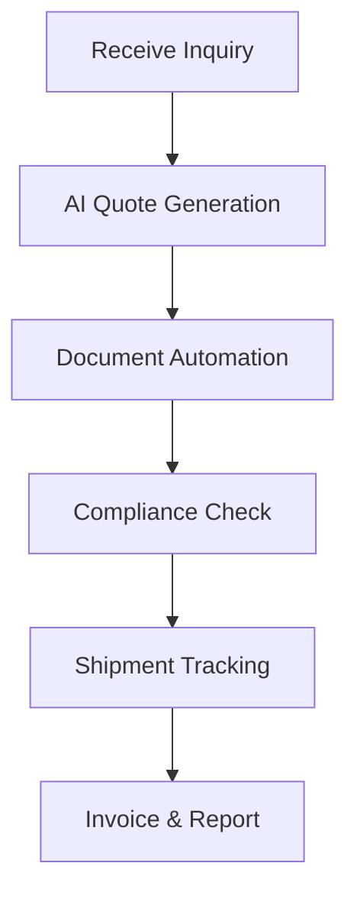

## Overview

Fresa Technologies delivers AI-enabled freight management software tailored for the shipping and freight forwarding industries. You manage all operations on a single platform, from quoting to compliance. The company mission focuses on simplifying complex logistics with intelligent automation, reducing manual errors, and accelerating processes for businesses of all sizes.

Founded to address inefficiencies in global trade, Fresa empowers forwarders with tools that integrate seamlessly into daily workflows.

## Key Benefits

Experience streamlined operations with these core advantages:

<Columns cols={3}>
  <Card title="AI-Assisted Quoting" icon="zap" href="/docs/quoting">
    Generate accurate quotes in seconds using AI that analyzes rates, routes, and regulations.
  </Card>
  <Card title="Automated Documentation" icon="file-text" href="/docs/documentation">
    Automate bills of lading, invoices, and certificates to eliminate paperwork delays.
  </Card>
  <Card title="Compliance Management" icon="shield" href="/docs/compliance">
    Stay audit-ready with real-time tracking of international shipping rules.
  </Card>
</Columns>

<Callout kind="success">
  Businesses using Fresa report up to 40% faster turnaround times and reduced compliance fines.
</Callout>

## Platform Overview

The Fresa platform unifies freight forwarding tasks. Explore key modules:

<Tabs>
  <Tab title="Quoting" icon="dollar-sign">
    Access real-time carrier rates and AI predictions for optimal pricing.
  </Tab>
  <Tab title="Shipment Tracking" icon="map-pin">
    Monitor shipments end-to-end with live updates and notifications.
  </Tab>
  <Tab title="Reporting" icon="bar-chart-3">
    Generate insights on profitability, volumes, and performance metrics.
  </Tab>
</Tabs>

## AI Capabilities

Fresa leverages machine learning for intelligent features:

- Predictive quoting based on historical data and market trends
- Document extraction using OCR and NLP for instant processing
- Risk assessment for compliance violations

<Expandable title="Advanced AI Details" default-open="false">

AI models process unstructured data like emails and PDFs, extracting shipment details with 98% accuracy. Integrate via REST API for custom workflows.

```javascript
// Example: Fetch AI quote
const response = await fetch('https://api.fresa.tech/v1/quotes/ai', {
  method: 'POST',
  headers: { 'Authorization': 'Bearer YOUR_API_KEY', 'Content-Type': 'application/json' },
  body: JSON.stringify({
    origin: 'SIN',
    destination: 'NYC',
    cargoType: 'electronics',
    weight: 500
  })
});
const quote = await response.json();
```

</Expandable>

## Getting Started

Launch your Fresa account quickly:

<Steps>
  <Step title="Sign Up" icon="user-plus">
    Create a free account at `https://app.fresa.tech/register`.
  </Step>
  <Step title="Configure Integrations" icon="settings">
    Connect your carriers and ERP systems via API keys.
  </Step>
  <Step title="Import Data" icon="upload">
    Upload existing shipments using CSV or API.
  </Step>
  <Step title="Generate First Quote" icon="zap">
    Test AI quoting with sample routes.
  </Step>
</Steps>

## Freight Workflow

Visualize the streamlined process:



<CodeGroup tabs="JavaScript,Python">
```javascript
// Integrate shipment creation
const shipment = await fresa.shipments.create({
  quoteId: 'q123',
  carrier: 'ocean-carrier-xyz',
  trackingNumber: 'TRK456'
});
```
```python
# Python SDK example
shipment = fresa.shipments.create(
    quote_id="q123",
    carrier="ocean-carrier-xyz",
    tracking_number="TRK456"
)
```
</CodeGroup>

Start transforming your freight operations today with Fresa Technologies.